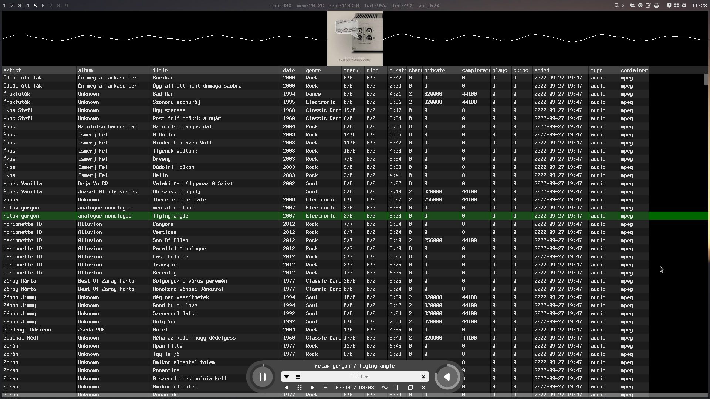

# Visual music player

Visuam Music Player is a music player, visualizer and organizer inspired by the 2000's era iTunes and the tracker music players of the early 90's.

Visual Music Player was made for [SwayOS](https://swayos.github.io).

[](https://www.youtube.com/watch?v=vAeLmADOVO0)

Watch the introduction/user guide [video on youtube](https://www.youtube.com/watch?v=vAeLmADOVO0)  
Or read the user guide for further information : [Open User Guide](MANUAL.md)

## Features ##

- retro-minimalistic UI
- beautiful and smooth UX experience
- frequency and scope analyzer visualizers
- library auto-organization ( if enabled in the command line )
- activity window and human-readable database for transparent operation
- super lightwight, no GTK/QT
- super fast headerless C power

## Description ##

Visuam Music Player is a music player, visualizer and organizer inspired by the 2000's era iTunes and the tracker music players of the early 90's.
It plays and organizes any kind of audio or video.  
By default it tries to parse music from the folder ~/Music. You can set a different library location with the -l switch.  
You can browse genres and artist by clicking on the filter button or you can do free text filter in the filter text field.  
With a right click or by pressing CTRL-V you can open the context menu. Edit, Delete the selected song from here or jump to the currently played song if not visible.  
You can also open the metadata viewer/editor by pressing on the editor button. Double click on the artist/album/title/genre field to edit it. Click on the folder button over the cover art to ember a new file as cover art.  
Scroll over the seek knob to set a new positon or click on it. Scroll over the volume knob to set volume or click on it.  
Click on the visualizer to select the next visualizer available.  
VMP's UI can be structured via html, styled via css.  

## Installation ##

Install the needed dependencies and libraries:

```
git meson ninja-build pkg-config - build tools
libpng,libgl,libglew,libegl,libwegl,libgles2,libfreetype,libxkbcommon,wayland-client,wayland-protocols - for rendering the ui and handling key events
libavutil,libavcodec,libavdevice,libavformat,libavfilter,libswscale,libswresample,libsdl2 - for media encode/decode
fonts-terminus - for default font

````

On debian based systems :
```
sudo apg-get install git meson ninja-build pkg-config libpng-dev libfreetype-dev libgl-dev libegl-dev libglew-dev libwayland-dev libxkbcommon-dev wayland-protocols libgles2-mesa-dev libsdl2-dev libswscale-dev libjpeg-dev libjbig2dec-dev libopenjp2-7-dev libharfbuzz-dev libavutil-dev libavdevice-dev

```

On arch based systems :
```
sudo pacman -Qs git meson pkg-config ninja glew wayland-protocols libpng freetype2 libgl libegl wayland wayland-protocols libxkbcommon ffmpeg
```

Then run these commands:

```
git clone https://github.com/milgra/vmp.git
cd vmp
meson build --buildtype=release
ninja -C build
sudo ninja -C build install
```

### Usage on floating window managers (GNOME,KDE) ###

Move the window by pressing your META key ( WIN key usually ) and drag on the window. Resize by dropping on the left or right side of the desktop.

## Command line options

-h 	   show help
-v 	   verbose
-l [path]  use custom library path, ~/Music is used by default
-o 	   toggle library organization, music files will be moved under [Library]/artist/album/track name.extension
-r [path]  set custom resource path

## Remote control

Send characters to /tmp/vmp, for example

```
echo "1" > /tmp/vmp
```

"1" toggle pause
"2" play next
"3" play previous song

## Technical Info ##

VMP was written in Headerless C. It is about using the __INCLUDE_LEVEL__ preprocessor macro available in GCC/CLANG to guard the implementation part of a source file so you can place it together with the header definition in a single file and you include this file freely in other source files. Read more about this in (https://github.com/milgra/headerlessc);

VMP uses Kinetic UI as UI/Widget rendering engine. It is a modern, minimal ui renderer with html/css based stylimg written in headerless C. It offers MacOS like smooth kinetic animations and font-level animatioms, gpu or cpu based alpha blending, wayland connector with window and layer support and deterministic session record and replay for fully automated application testing.

VMP uses the mt_core library for retain counted memory management, retain counted and recursively observable vector and map containers and helper functions.

VMP uses meson and ninja for lightning fast compilation.
